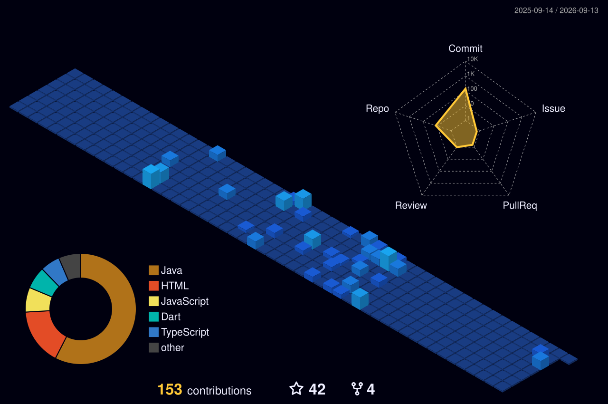

<!-- Dynamic Waving Header -->

  

<!-- Animated Typing Text -->
<h3 align="center">
  
</h3>

  

 

<!-- 3D/Creative Layout for Intro -->
<table align="center" style="border: none;">
  <tr>
    <td width="60%">
      <h3>👨‍💻 About Me</h3>
      <ul>
        <li>🌱 I’m currently deep-diving into <b>JEE</b></li>
        <li>💬 Ask me about <b>C, Java, and Backend Architecture</b></li>
        <li>🚀 All my projects are available in my <a href="https://github.com/Charef-Sohail?tab=repositories">Repositories</a></li>
        <li>⚡ Fun fact: When I'm not coding, I love playing and watching <b>Football ⚽</b></li>
      </ul>
      <h3>📫 Connect with me</h3>
      
      
    </td>
    <td width="40%" align="center">
      <!-- 3D Animated Developer GIF -->
      
    </td>
  </tr>
</table>

 

<!-- Unified Tech Stack Badges -->
<h3 align="center">🛠️ Languages and Tools</h3>

  
  
  
  
  
    
  
  
  
    
  
  
  

 

<!-- 3D Contribution Graph -->
<h3 align="center">🌆 3D Contribution Calendar</h3>

  <picture>
    <source media="(prefers-color-scheme: dark)" srcset="./profile-3d-contrib/profile-night-view.svg">
    <source media="(prefers-color-scheme: light)" srcset="./profile-3d-contrib/profile-season-animate.svg">
    
  </picture>

 

<!-- Contribution Snake Animation -->
<h3 align="center">🐍 Contribution Activity</h3>

  <picture>
    <source media="(prefers-color-scheme: dark)" srcset="https://raw.githubusercontent.com/Charef-Sohail/Charef-Sohail/output/github-contribution-grid-snake-dark.svg">
    <source media="(prefers-color-scheme: light)" srcset="https://raw.githubusercontent.com/Charef-Sohail/Charef-Sohail/output/github-contribution-grid-snake.svg">
    
  </picture>

